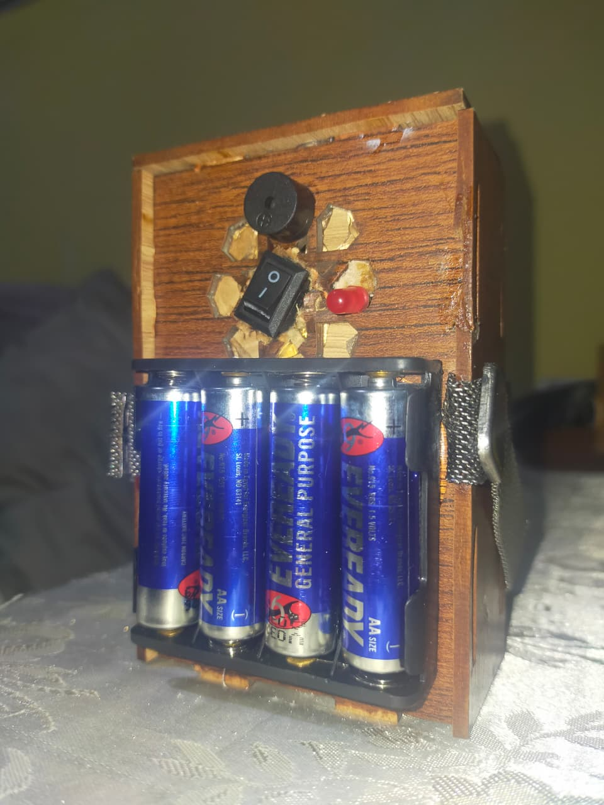
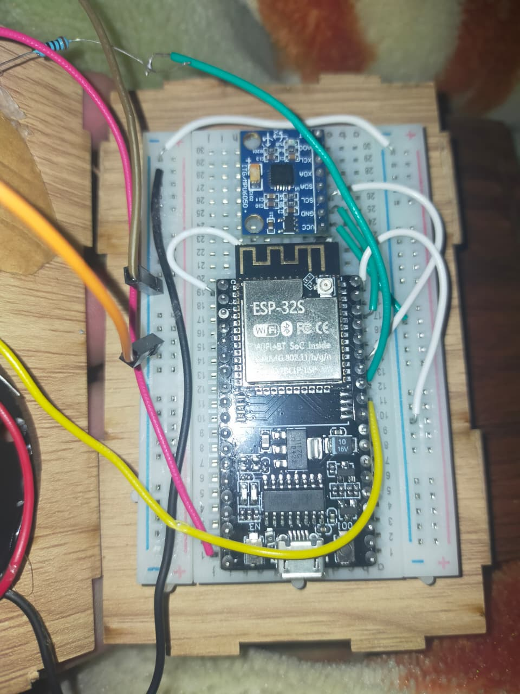
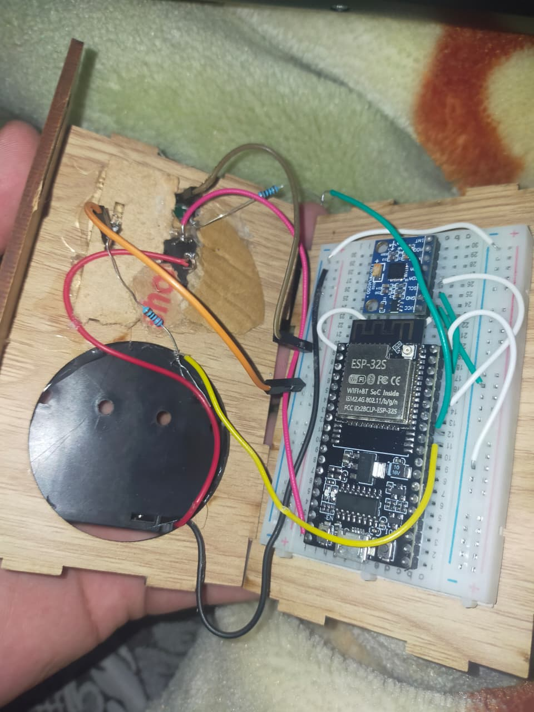
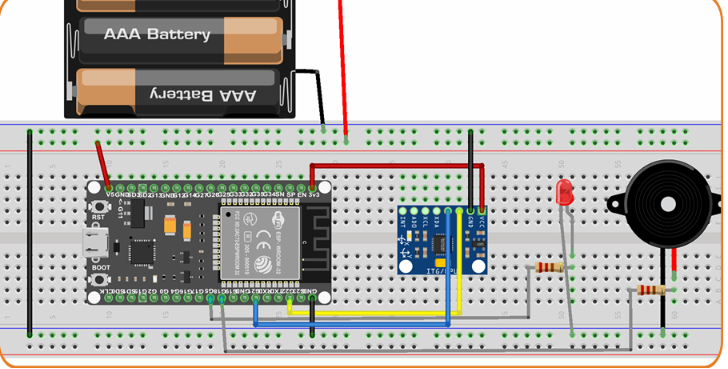
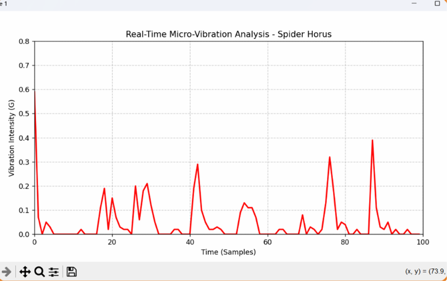

# 🕷️ Spider Horus – Real-Time Industrial Vibration Monitoring System


A real-time industrial vibration monitoring system designed to detect abnormal machine vibrations using an **ESP32** and **MPU6050** accelerometer. The system wirelessly transmits vibration data to a Python desktop application using **UDP over Wi-Fi**, providing live visualization, automatic anomaly detection, and instant alarm notifications.

---

# 📸 Project Preview

<p align="center">

</p>

---

# 📌 Overview

Unexpected machine failures are often preceded by abnormal vibration patterns. **Spider Horus** continuously monitors vibration intensity, filters sensor noise, visualizes measurements in real time, and alerts the operator whenever dangerous vibration levels are detected.

The project demonstrates how embedded systems and Python-based visualization can be combined to create a low-cost predictive maintenance solution suitable for industrial environments.

---

# ✨ Features

- 📈 Real-time vibration monitoring
- 📡 Wireless communication via Wi-Fi
- 📤 UDP data transmission
- ⚙️ Automatic sensor calibration
- 🔍 Noise filtering for stable readings
- 🚨 LED & Buzzer alarm system
- 📊 Live vibration graph
- 🖥 Python desktop monitoring application
- 🏭 Suitable for predictive maintenance applications

---

# 📷 Hardware Gallery

<p align="center">


</p>

<p align="center">


</p>

---

# 🛠 Hardware Components

- ESP32 Development Board
- MPU6050 Accelerometer & Gyroscope
- Active Buzzer
- Red LED
- Breadboard
- Jumper Wires
- Power Supply

---

# 💻 Software & Technologies

- Arduino IDE
- Python 3
- ESP32 Arduino Framework
- Matplotlib
- Socket Programming
- UDP Networking
- Wi-Fi Communication

---

# 📂 Repository Structure

```text
Spider-Horus-Vibration-Monitoring
│
├── firmware/
│   └── spider_horus.ino
│
├── python/
│   └── monitor.py
│
├── images/
│   ├── setup.jpeg
│   ├── prototype.jpeg
│   ├── prototype1.jpeg
│   ├── circuit_wiring.png
│   └── graph.png
│
├── docs/
│
├── requirements.txt
├── README.md
├── LICENSE
└── .gitignore
```

---

# ⚙️ System Architecture

```text
MPU6050 Sensor
        │
        ▼
ESP32 Firmware
        │
        ▼
Auto Calibration
        │
        ▼
Noise Filtering
        │
        ▼
UDP over Wi-Fi
        │
        ▼
Python Desktop Monitor
        │
        ▼
Live Graph Visualization
        │
        ▼
LED & Buzzer Alarm
```

---

# 🚀 Getting Started

## Clone the Repository

```bash
git clone https://github.com/Mahmoud20005/Spider-Horus-Vibration-Monitoring.git
```

---

## Install Python Dependencies

```bash
pip install -r requirements.txt
```

---

## Upload ESP32 Firmware

1. Open Arduino IDE.
2. Install the ESP32 board package.
3. Open `firmware/spider_horus.ino`.
4. Configure your Wi-Fi credentials.
5. Upload the firmware to the ESP32.

---

## Run the Python Monitor

```bash
python python/monitor.py
```

---

# 📊 Experimental Results

The developed system successfully achieved:

- Approximately **100 Hz** sampling rate
- Stable real-time Wi-Fi communication
- Low-latency UDP data transmission
- Live vibration visualization
- Automatic abnormal vibration detection
- Reliable LED and buzzer alarm activation
- Continuous monitoring with low computational overhead

---

# 🎯 Applications

- Industrial Machine Monitoring
- Predictive Maintenance
- Motor Health Monitoring
- Mechanical Equipment Diagnostics
- Smart Factory Systems
- Industrial IoT

---

# 🔧 Future Improvements

- MQTT Cloud Integration
- Node-RED Dashboard
- Raspberry Pi Edge Gateway
- Machine Learning Fault Prediction
- FFT Frequency Analysis
- Database Logging
- Mobile Monitoring Application

---

# 👨‍💻 Author

## Mahmoud Ibrahim

**Mechatronics Engineering Student**

Interested in:

- Embedded Systems
- Industrial IoT
- Robotics
- Industrial Automation
- Edge AI

💼 LinkedIn

https://www.linkedin.com/in/mahmoud-ibrahim-755ab4315

💻 GitHub

https://github.com/Mahmoud20005

---

## 📜 License

This project is licensed under the MIT License.

---

## ⭐ Support

If you found this project useful, please consider giving it a ⭐ on GitHub.
